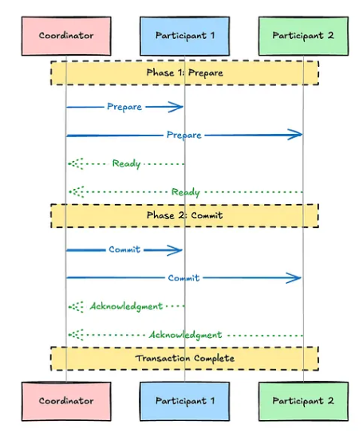

.. _2pc_concurrency_control-db-label:

Two Phase Commit
================

Overview
--------
- in a distributed system, different services often need to coordinate with each other — whether it’s fetching data, pushing events, or ensuring a consistent state across multiple services
- The Two-Phase Commit (2PC) protocol is a mechanism used in distributed database systems to ensure that a transaction is either fully completed or entirely rolled back across multiple nodes
- example: bank transfer:
    - Suppose we want to transfer money from one account to another.
    - To maintain consistency, we must ensure that:
        - During the transaction, the affected records are isolated from other operations.
        - Both sub-transactions — debiting from one account and crediting to another — must either both succeed or both fail.

    .. code-block:: python
           :linenos:

            BEGIN;
            UPDATE amount SET balance = balance - 10000 WHERE account_id = '100';
            UPDATE amount SET balance = balance + 10000 WHERE account_id = '200';
            COMMIT;

The problem
------------
- As traffic grows, we may need to shard our database, meaning the rows involved in a transaction could be stored on different database instances or even separate servers
- In such cases, a single locked transaction won’t work because the changes invloves multiple independent databases

How is working
--------------
- it has 2 steps:
    - prepare phase
    - commit phase
- a central coordinator:
    - The Transaction Coordinator is a node or server responsible for managing the transaction across multiple participants
    - It initiates the commit process, communicates with all participant nodes, and ensures that they either all commit or all abort the transaction, preventing inconsistencies
- participant:
    - are the nodes involved in the transaction
    - They execute the actual operations of the transaction and respond to the coordinator’s instructions
    - decides whether it can commit the transaction based on its local constraints and then follows the coordinator’s final decision
    - These can be DB shards , different microservices or any other integral consistent system

Prepare Phase
-------------
1. The coordinator sends a “Prepare” request to all participants, asking if they can commit the transaction.
2. Each participant performs local checks (such as ensuring data integrity, locking required resources, and verifying constraints).
3. Participants respond with either:
    - “Yes” (Ready to Commit): If the participant is prepared to commit.
    - “No” (Abort): If the participant cannot commit due to some failure or constraint violation.

Commit Phase
------------
- If all participants respond with “Yes”, the coordinator sends a “Commit” message to all participants, instructing them to finalize the transaction.
- If any one participant responds with “No”, the coordinator sends an “Abort” message to all participants, ensuring that the transaction is rolled back across the system.

Failure Scenarios in 2PC
------------------------
1. Coordinator Failure

- If the coordinator crashes before sending the final decision:
    - Before “Prepare” request: No impact; transaction is abandoned.
    - After “Prepare” but before responses: Participants time out and abort.
    - After collecting responses but before commit/abort: Participants remain blocked, leading to resource locking.

- Mitigation:
    - Coordinator replication or timeout-based aborts.
    - Write-Ahead Logging (WAL) for recovery.

2. Participant Failure

- If a participant fails during the process:
    - Before “Prepare”: The coordinator aborts due to timeout.
    - After “Prepare” but before response: The coordinator waits, then aborts if no response.
    - After voting “Yes” but before commit/abort: The participant is uncertain about the final decision upon recovery.

- Mitigation:
    - WAL for recovery.
    - Coordinator retries after failure.

3. Network Issues

- Network failures can cause:
    - Coordinator can’t reach all participants: Some are blocked waiting for the decision.
    - Partition after commit/abort message: Some nodes commit while others remain uncertain, leading to inconsistency.

- Mitigation:
    - Timeout-based aborts for participants.
    - Distributed consensus protocols (Paxos, Raft) to avoid a single point of failure.
    - Persistent logging for recovery after network restoration.

Drawbacks
---------
- Synchronous Blocking:
    - 2PC is a blocking protocol, meaning participants must wait until the coordinator reaches a decision
    - If a participant has voted Yes (Prepared), it cannot unilaterally abort, leading to potential resource locking
- Single Point of Failure:
    - The coordinator plays a central role, and if it crashes after collecting responses but before sending the commit/abort decision, participants remain stuck in uncertainty
    - Recovery mechanisms like coordinator replication and Write-Ahead Logging (WAL) are required, adding complexity.
- High Overhead in Distributed Environments:
    - Every transaction requires multiple network round-trips (Prepare → Votes → Commit/Abort), increasing latency
    - All participants must maintain locks during the process, which can slow down concurrent operations.
    - This makes 2PC less efficient for high-throughput distributed systems like cloud-based databases.
- CAP Theorem Considerations:
    - According to the CAP theorem, distributed systems must trade off Consistency , Availability , or Partition Tolerance
    - 2PC prioritizes consistency (all nodes commit or abort together) but sacrifices availability

Optimizations
-------------
- Three-Phase Commit (3PC)
    - 3PC introduces an additional “Pre-Commit” phase between Prepare and Commit to minimize blocking
    - Unlike 2PC, 3PC ensures that no participant remains indefinitely locked if the coordinator fails.
    - However, it still does not guarantee consistency under network partitions, making it less reliable than consensus-based protocols
- Paxos & Raft Consensus Protocols — Fault-Tolerant Agreement:
    - Consensus protocols like Paxos and Raft eliminate the need for a single coordinator
    - Instead of a centralized commit decision, they use majority voting to reach agreement, making them more resilient to failures.
    - These protocols are commonly used in distributed databases (e.g., Google Spanner, etcd) where high availability is crucial.
- Optimistic & Pessimistic Concurrency Control — Alternative Transaction Models
- Saga Pattern:
    - Unlike 2PC, Saga breaks a transaction into smaller, independent steps where each step has a compensating action in case of failure.
    - Its non-blocking, scales well but can lead to potential inconsistency.

:ref:`Go Back <db-label>`.