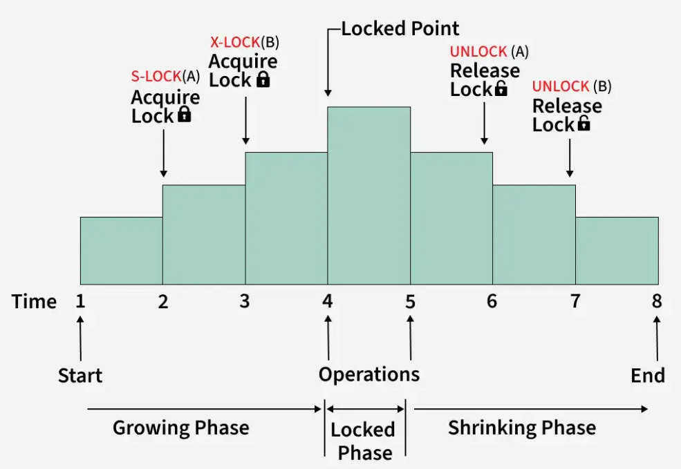

.. _2pl_concurrency_control-db-label:

Two Phase Locking Protocol
==========================

Overview
--------
- is a key technique used in DBMS to manage how multiple concurrent transactions access and modify data
- It divides a transaction into two phases:
    - Growing Phase: In this step, the transaction gathers all the locks it needs to access the required data. During this phase, it cannot release any locks
    - Shrinking Phase: Once a transaction starts releasing locks, it cannot acquire any new ones. This ensures that no other transaction interferes with the ongoing process

Types of Lock
-------------
- Shared Lock (S):
    - Shared Lock is also called a read-only lock
    - allows multiple transactions to access the same data item for reading at the same time
    - transactions with this lock cannot make changes to the data
    - A shared lock is requested using the lock-S instruction
- Exclusive Lock (X):
    - An Exclusive Lock allows a transaction to both read and modify a data item
    - This lock is exclusive, meaning no other transaction can access the same data item while this lock is held
    - An exclusive lock is requested using the lock-X instruction.

Lock Conversion
---------------
- In the Two-Phase Locking Protocol, lock conversion means changing the type of lock on data while a transaction is happening
- Upgrading a Lock:
    - This means changing a shared lock (S) to an exclusive lock (X)
    - For example, if a transaction initially only needs to read data (S) but later decides it needs to update the same data, it can request an upgrade to an exclusive lock (X):
        - However, this can only happen during the Growing Phase, where the transaction is still acquiring locks
- Downgrading a Lock:
    - This means changing an exclusive lock (X) to a shared lock (S)
    - For instance, if a transaction initially planned to modify data (X lock) but later decides it only needs to read it, it can downgrade the lock
    - However, this must happen during the Shrinking Phase, where the transaction is releasing locks

Lock point
----------
- The lock point in a transaction is the moment when the transaction finishes acquiring all the locks it needs
- After this point, no new locks can be added, and the transaction starts releasing lock
- It’s a key step in the Two-Phase Locking Protocol to ensure the rules of growing and shrinking phases are followed.

Drawbacks
---------
- Deadlocks: Transactions can get stuck waiting for each other’s locks, causing them to freeze indefinitely.
- Cascading Rollbacks: If one transaction fails, others that depend on it might also fail leading to inefficiency and potential data issues.
- Lock Contention: Too many transactions competing for the same locks can slow down the system, especially when many users are working at the same time.
- Limited Concurrency: The strict rules of 2PL can reduce how many transactions can run at once, resulting in slower performance and longer wait times.

:ref:`Go Back <db-label>`.