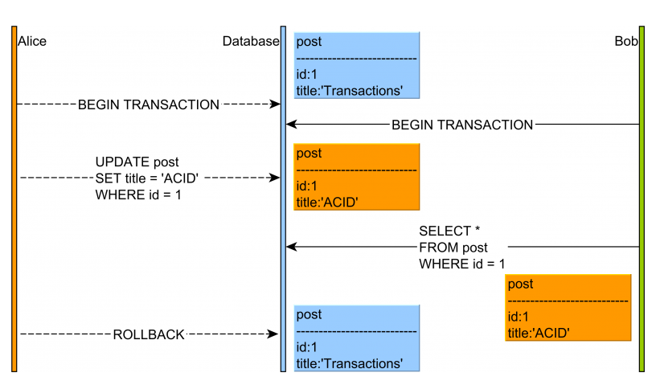
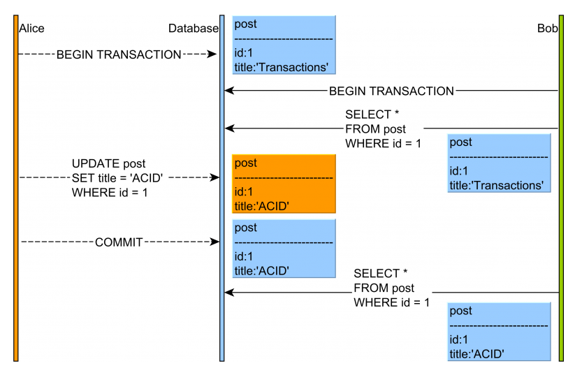
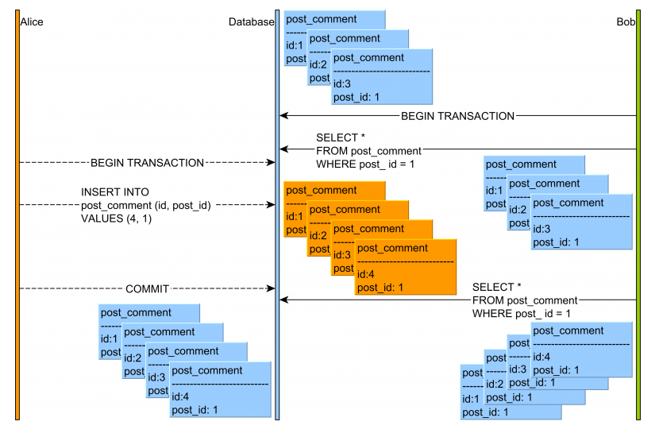
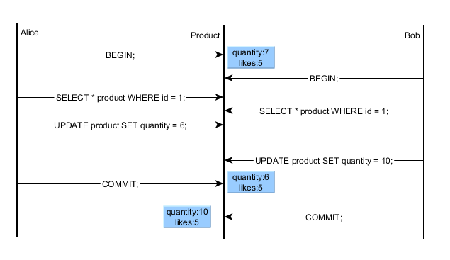
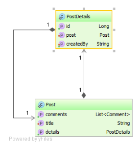
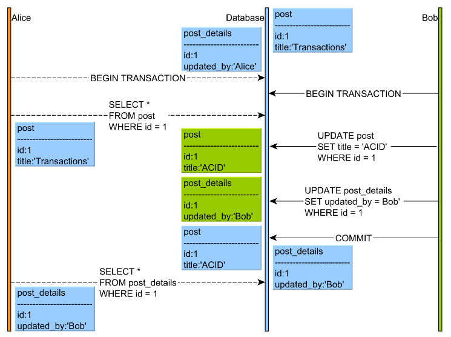
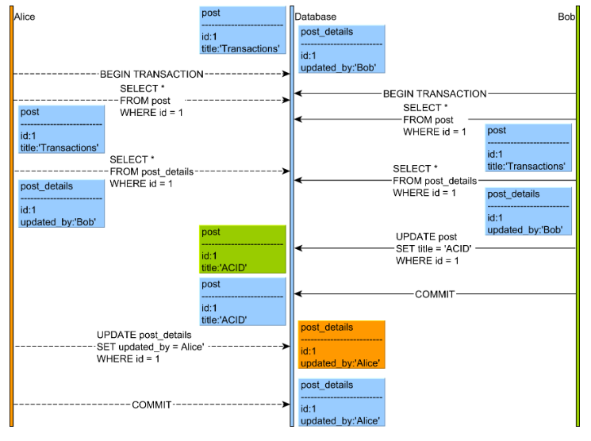

.. _isolation_levels-label:

Isolation Levels
==================
    - The SQL standard defines four Isolation levels:
        - READ_UNCOMMITTED
        - READ_COMMITTED
        - REPEATABLE_READ
        - SERIALIZABLE

+------------------+------------+-----------------------+---------------+
| ISOLATION LEVEL  | DIRTY READ | NON-REPEATABLE READ   | PHANTOM READ  |
+==================+============+=======================+===============+
| READ_UNCOMMITTED | allowed    | allowed               | allowed       |
+------------------+------------+-----------------------+---------------+
| READ_COMMITTED   | prevented   | allowed              | allowed       |
+------------------+------------+-----------------------+---------------+
| REPEATABLE_READ  | prevented  | prevented             | allowed       |
+------------------+------------+-----------------------+---------------+
| SERIALIZABLE     | prevented  | prevented             | prevented     |
+------------------+------------+-----------------------+---------------+

Dirty Read
----------
- A dirty read happens when a transaction is allowed to read the uncommitted changes of some other concurrent transaction
- Taking a business decision on a value that has not been committed is risky because uncommitted changes might get rolled back
- This anomaly is only permitted by the Read Uncommitted isolation level, and, because of the impact on data integrity, most database systems offer a higher default isolation level

- what happens:
    1. Alice and Bob start two database transactions.
    2. Alice modifies the title of a given post record.
    3. Bob reads the uncommitted post record.
    4. If Alice commits her transaction, everything is fine. But if Alice rolls back, then Bob will see a record version that no longer exists in the database transaction log.

- how the db prevents it:
    - To prevent dirty reads, the database engine must hide uncommitted changes from all other concurrent transactions.
    - Each transaction is allowed to see its own changes
    - If the underlying database uses 2PL (Two-Phase Locking), the uncommitted rows are protected by write locks which prevent other concurrent transactions from reading these records until they are committed.
    - When the underlying database uses MVCC (Multi-Version Concurrency Control), the database engine can use the undo log which already captures the previous version of every uncommitted record, to restore the previous value in other concurrent transaction queries

Non-repeatable read
-------------------
- A non-repeatable read manifests when consecutive reads yield different results due to a concurring transaction that has just updated the record we’re reading
- This is prevented by holding a shared lock (read lock) on the read record for the whole duration of the current transaction
- If one transaction reads a database row without applying a shared lock on the newly fetched record, then a concurrent transaction might change this row before the first transaction has ended
- Repeatable Read and Serializable prevent this anomaly by default
- With Read Committed, it is possible to avoid non-repeatable (fuzzy) reads if the shared locks are acquired explicitly (e.g. SELECT FOR SHARE).

- what happens:
    1. Alice and Bob start two database transactions.
    2. Bob reads the post record and title column value is Transactions.
    3. Alice modifies the title of a given post record to the value of ACID.
    4. Alice commits her database transaction.
    5. If Bob’s re-reads the post record, he will observe a different version of this table row.

- how the db prevents it:
    - If a database uses a 2PL (Two-Phase Locking) and shared locks are taken on every read, this phenomenon will be prevented since no concurrent transaction would be allowed to acquire an exclusive lock on the same database record.
    - Most database systems have moved to an MVCC (Multi-Version Concurrency Control) model, and shared locks are no longer mandatory for preventing non-repeatable reads.
    - By verifying the current row version, a transaction can be aborted if a previously fetched record has changed in the meanwhile.

Phantom read
------------
- A phantom read happens when a subsequent transaction inserts a row that matches the filtering criteria of a previous query executed by a concurrent transaction
- This is prevented using range locks or predicate locking

- what happens:
    1. Alice and Bob start two database transactions.
    2. Bob’s reads all the post_comment records associated with the post row with the identifier value of 1.
    3. Alice adds a new post_comment record which is associated with the post row having the identifier value of 1.
    4. Alice commits her database transaction.
    5. If Bob’s re-reads the post_comment records having the post_id column value equal to 1, he will observe a different version of this result set.

- how the db prevents it:
    - The 2PL-based Serializable isolation prevents Phantom Reads through the use of predicate locking
    - MVCC (Multi-Version Concurrency Control) database engines address the Phantom Read anomaly by returning consistent snapshots

Lost updates
------------
- If two transactions are updating different columns of the same row, then there is no conflict. The second update blocks until the first transaction is committed and the final result reflects both update changes
- If the two transactions want to change the same columns, the second transaction will overwrite the first one, therefore losing the first transaction update
- So an update is lost when a user overrides the current database state without realizing that someone else changed it between the moment of data loading and the moment the update occurs

- In this example Bob is not aware that Alice has just changed the quantity from 7 to 6, so her UPDATE is overwritten by Bob’s change

- solution:
    1. Repeatable Read mode:
        - In PostgreSQL, a Repeatable Read query will see the data snapshot as of the start of the current transaction
        - Changes committed by other concurrent transactions are not visible to the current transaction

    .. image:: ../images/db/isolation_level/lost_update_repeatable_read.png
       :width: 1000px
       :height: 1200px
       :scale: 50 %
       :align: center

    2. SELECT FOR UPATE
        - another solution would be to use "FOR UPDATE" with default READ COMMITTED isolation level. This locking clause acquires the same write locks as with UPDATE and DELETE statements
        - the second transaction could not process the SELECT until the WRITE lock is released from the first transaction
        - both transaction needs to use "FOR UPDATE" locking, if not, the Lost Update can still happen

    .. image:: ../images/db/isolation_level/lost_update_select_for_update.png
       :width: 1000px
       :height: 1200px
       :scale: 50 %
       :align: center

    3. Optimistic Locking
        - like MVCC, optimistic locking defines a versioning concurrency control model that works without acquiring additional database write locks
        - the table will include a version column that prevents old data snapshots to overwrite the latest data 

    .. image:: ../images/db/isolation_level/lost_update_optimistic_locking.png
       :width: 1000px
       :height: 1200px
       :scale: 50 %
       :align: center

Read skew
---------

- what happens:
    - Alice selects a Post entity.
    - Bob sneaks in and updates both the Post and the PostDetails entities.
    - Alice thread is resumed and she selects the PostDetails record.
- if read skew is permitted, Alice sees Bob’s update and she can assume that the previous Post version (that she read at the beginning of her transaction) was issued by Bob, therefore breaking consistency.
- with ProstgreSQL, read skew is solved from REPEATABLE READ mode

Write Skew
----------

- what happends:
    - Both Alice and Bob select the Post and the PostDetails entities.
    - Bob modifies the Post title, but, since the PostDetails is already marked as updated by Bob, the dirty checking mechanism will skip updating the PostDetails entity, therefore preventing a redundant UPDATE statement.
    - Alice wants to update the Post entity, but the entity already has the same value as the one she wants to apply so only the PostDetails record will mark that the latest change is the one proposed by Alice.

- If write skew is permitted, Alice and Bob disjoint writes will proceed, therefore breaking the guarantee that Post and PostDetails should always be in sync.
- with ProstgreSQL, read skew is solved from SERIALIZABLE mode

:ref:`Go Back <db-label>`.