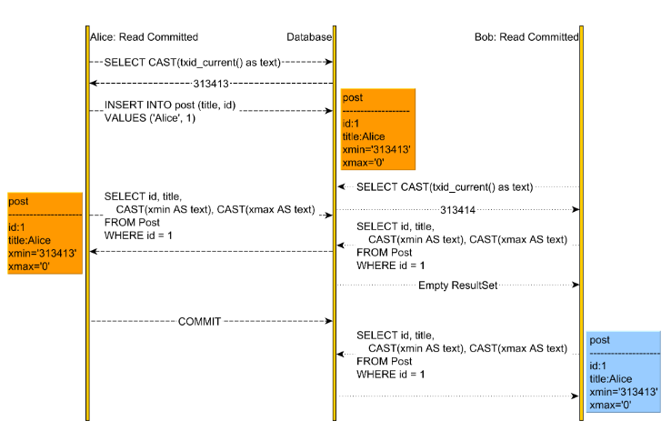

.. _mvcc-label:

Multi Version Concurrency Control
=================================

Overview
--------
- In Concurrency Control theory, there are two ways you can deal with conflicts:
    - You can avoid them, by employing a pessimistic locking mechanism (e.g. Read/Write locks, Two-Phase Locking)
    - You can allow conflicts to occur, but you need to detect them using an optimistic locking mechanism (e.g. logical clock, MVCC)

- when using 2PL, every read requires a shared lock acquisition, while a write operation requires taking an exclusive lock:
    - a shared lock blocks Writers, but it allows other Readers to acquire the same shared lock
    - an exclusive lock blocks both Readers and Writers concurring for the same lock
- but the 2PL approach, the contention affects calability, so we need another approach which:
    - Readers don’t block Writers
    - Writers don’t block Readers
    - The only use case that can still generate contention is when two concurrent transactions try to modify the same record since, once modified, a row is always locked until the transaction that modified this record either commits or rolls back.
    - the Concurrency Control mechanism must operate on multiple versions of the same record

Inserting a record
------------------

// TODO : add more details

:ref:`Go Back <db-label>`.