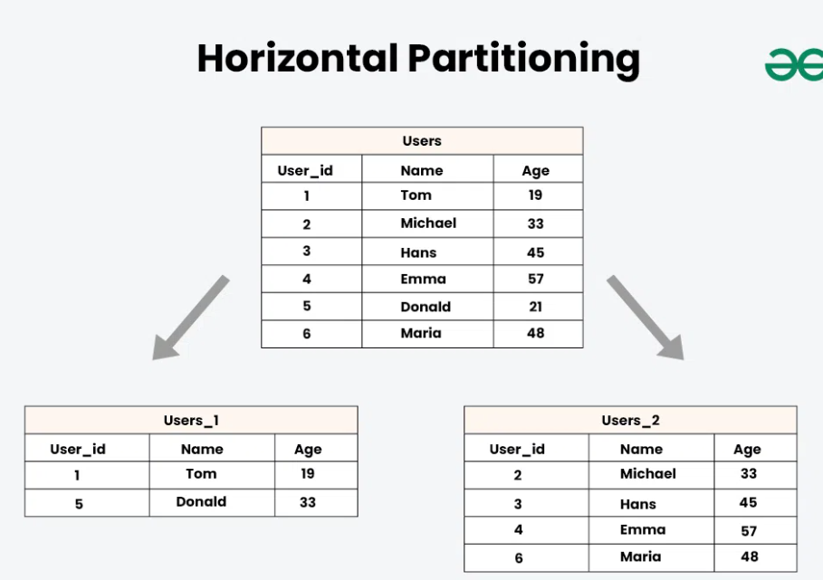
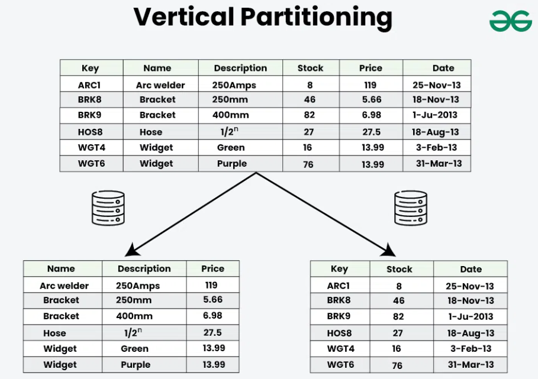
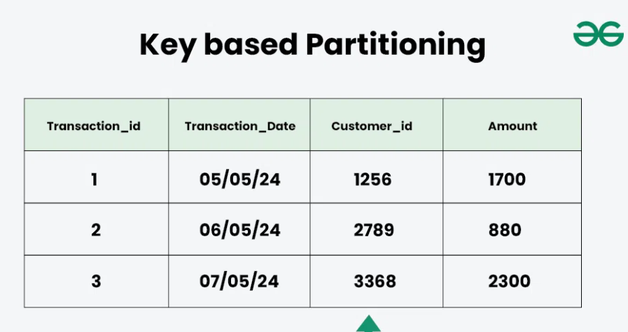
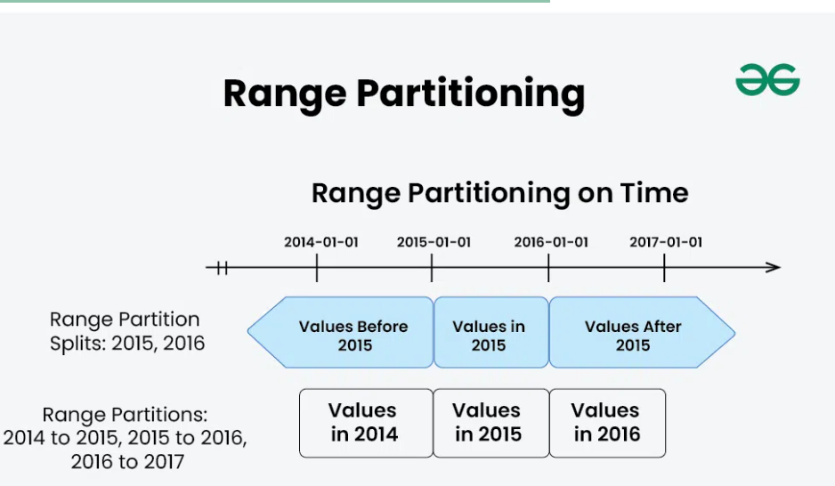
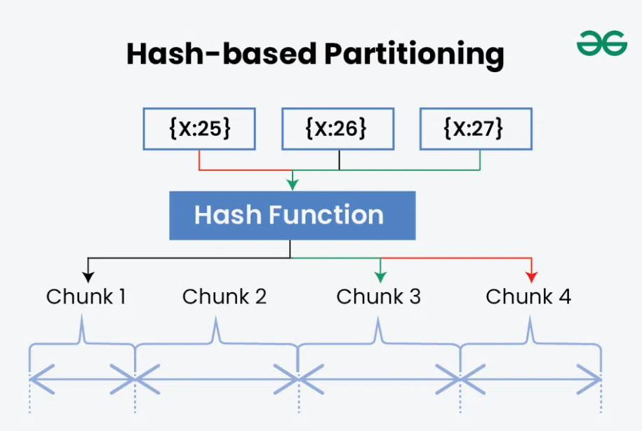
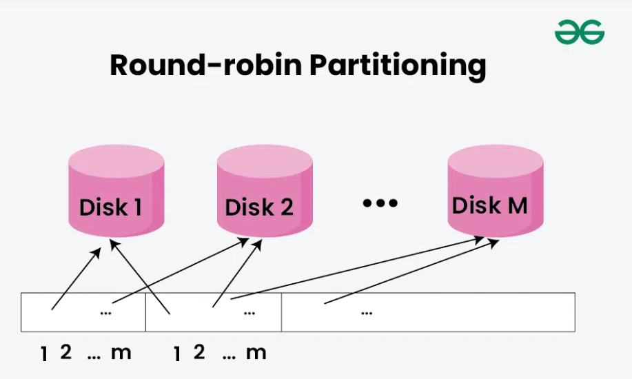

.. _partitioning-label:

Partitioning
============

Overview
--------

- data partitioning is the process of splitting a dataset into more manageable, smaller pieces in orde rto improve efficiency, scalability and performance
- It can be accomplished by either vertical partitioning, which separates data into columns, or horizontal partitioning, which divides data into rows according to particular criteria
- This method is especially helpful in databases, big data processing frameworks, and machine learning applications since it enables quicker query execution, simpler management of massive datasets, and better resource use

Examples
--------
- E-commerce Platforms: Customer data is partitioned by region (e.g., North America, Europe) to optimize shipping, inventory, and localized marketing, improving performance and user experience.
- Banking and Finance: Transaction data is partitioned by account type or date (e.g., daily) for faster processing, reporting, and more efficient fraud detection.
- Social Media: User data is split by demographics or interests to enable targeted ads and content, enhancing relevance and system efficiency.

Why is needed ?
---------------
- Performance improvement: By breaking data into smaller segments, systems can access only the relevant partitions, leading to faster query execution and reduced load times
- Scalability: as datasets grow, partitioning allows for easier management and distribution accross multiple servers or storage system, enabling horizontal scaling
- Efficient Resource Utilization: It helps optimize the use of resources by allowing systems to focus processing power on specific partitions rather than the entire dataset
- Enhanced Manageability: Smaller partitions are easier to back up, restore, and maintain

Method of Data Partitioning
---------------------------

1. Horizontal Partitioning/Sharding
- divides data by rows, but all partitions may still exist on the same server. When these horizontal partitions are placed across multiple servers, the approach is called Sharding
- Sharding is a special case of horizontal partitioning that provides true horizontal scalability and high availability by distributing partitions accross multiple machines

- Pros:
    - Scalability: enable parallel processing of large datasets across multiple nodes
    - Load Balacing: distributes work evenly
    - fault tolerance: each partition operates independently

- Cons:
    - complex joins: crosss-partition joins are more complex and slower
    - data skew: uneven data distribution can lead to performance issues

2. Vertical Partitioning
- separates the dataset according to columns or attributes
- Each partition in this method has a subset of columns for every row
- When certain columns are visited more frequently than others or when different columns have different access patterns, vertical partitioning might be helpful

- Pros:
    - Better query performance: reduces data read by isolating frequently accessed columns
    - efficient retrieval: fetches only needed columns, saving I/O storage
    - easier schema changes: simplifies adding or removing columns

- Cons:
    - query cmplexity: queries may need to access multiple partitions
    - slower joins: combining data from different partitions adds overhead
    - limited scalability: not ideal for datasets with rapidly growing columns

3. Key-based partitioning
- Divides data based on a specific key or attribute, with each partition holding all data related to that key
- Common in distributed systems for uniform data distribution and efficient key-based lookups

- Pros:
    - even distribution: stores data with the same key togethr for efficient lookups
    - scalability enables parallel processing across partitions
    - load balacing: distributes worload to avoid performance bottleneks

- Cons:
    - data skew: uneven key access can create hotspots
    - limited flexibility: less efficient for range or multi-key queries
    - partition overhead: requires careful management as data or key patterns evolve

4. Range partitioning
- The dataset is divided using range partitioning based on a preset range of values
- For example, if your dataset has timestamps, you can divide it according to a specific time range
- Range partitioning might be useful when you have data with natural ordering and wish to distribute it evenly based on the range of values

- Pros:
    - natural ordering: ideal for data with an inherent rance-based structure
    - efficient range queries: quikly locates data within specified value ranges
    - simplified query planning: system easily identigies relecant partitions for range conditions

- Const:
    - Data skew: uneven data across range can affect performance
    - growth management: adding or adjusting ranges requires ongoing maintenance
    - complex joins: oins and non-continuous range queries can be slower and harder to manage

5. Hash-based partitioning
- is the technique of employing a hash function to analyze data and determine which division it belongs to
- After being fed the data, the hash function generates a hash value that is used to classify the data into a particular division
- Hashing-based partitioning can help in load balancing and speedy data retrieval by dividing data among partitions at random

- Pros:
    - even distribution: randomized hashig spreads data unformly across partitions
    - scalability: supports parallel processing across multiple nodes
    - simplicity: easy to implement and doesn\t rely on data order

- Cons:
    - inefficient lookups: poor performance for key-based or range queries
    - possible imbalances: hashing may not always ensure perfect load distribution
    - maintenance overhead: scaling may require repartitioning and rehashing data

6. Round-Robin parttioning
-  Data is cyclically and equally distributed among partitions
- Regardless of the properties of the data, each split is sequentially assigned the next accessible data item
- Implementing round-robin partitioning is simple and can offer a minimal degree of load balancing

- Pros:
    - Even Data Distribution: Ensures near-uniform distribution of records across partitions.
    - Simple Implementation: Very easy to implement; no hashing or key logic required.
    - Good Load Balancing: Works well for write-heavy workloads and parallel processing.

Const:
    - Inefficient Lookups: Poor performance for key-based or range queries.
    - No Data Locality: Related records may be spread across different partitions.
    - Limited Query Optimization: Not suitable for analytical queries that depend on grouping or ranges.

:ref:`Go Back <db-label>`.