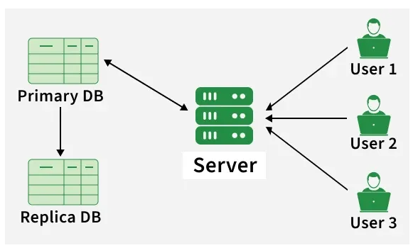
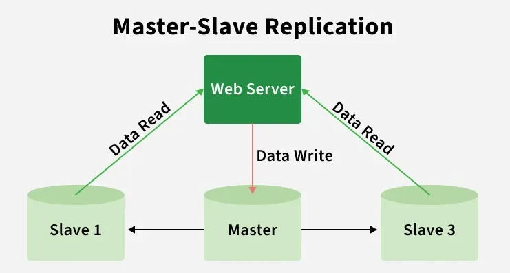
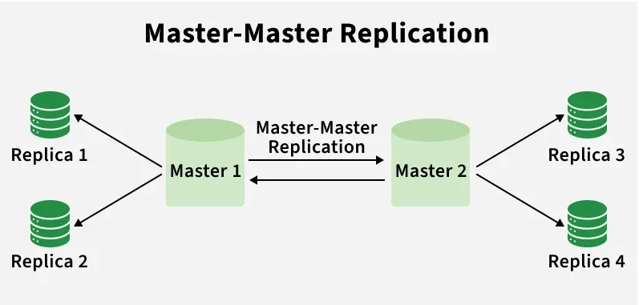
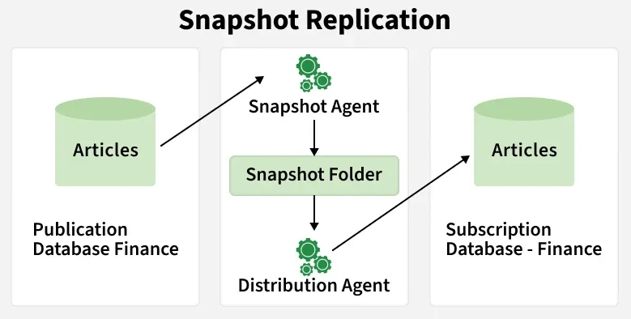
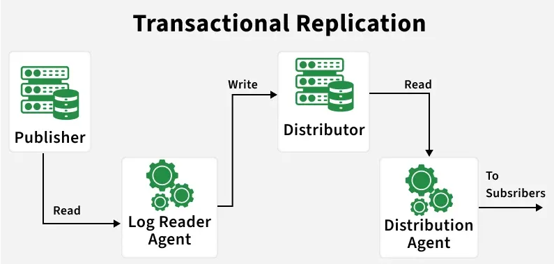
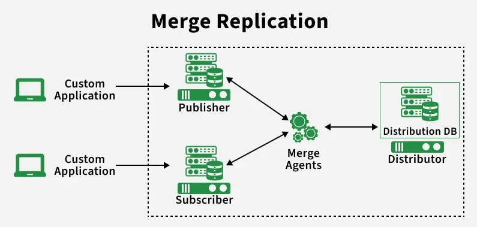

.. _replication-label:

Replication
===========

Overview
--------

- database replication means creating and maintaining multiple copies of the same datbse on different servers
- it is used to improve high availability, reliability, scalability and data accessibility
- if one database server fails, another replica can continue serving requests

How is working with replication
-------------------------------

1. Identify the Primary Database (Source): A primary (or master) database is chosen as the main source of truth where data changes originate.
2. Set Up Replica Databases (Targets): One or more replicas (or secondary databases) are configured to receive data from the primary database.
3. Data Changes Captured: Any updates, inserts, or deletes in the primary database are recorded, typically through a transaction log or change data capture mechanism.
4. Transmit Changes to Replicas: The captured changes are sent to replica databases over the network in real-time or at scheduled intervals.
5. Apply Changes on Replicas: The replicas apply these updates to keep their data in sync with the primary database.
6. Monitor and Maintain Synchronization: The system ensures replicas stay up-to-date and handles issues like delays or conflicts during synchronization.
7. Read or Write Operations: Applications can read data from replicas (to reduce load on the primary) and may write to the primary, depending on the replication model (e.g., Master-Slave, Master-Master).

Types of replication
--------------------

1. Master-Slave replication
2. Mster-Master replication
3. Snapsot Replication
4. Transactional Replication
5. Merge Replication

1. Master-Slave replication
---------------------------
- all wrote operations are handled by the master database
- the updated data is synchronized to slave databases
- master handles all inserts, updates, deletes
- slaves maintain replicated copies of master data
- improve read performance by using slaves for queries
- provide basic fault tolerence

Working:
    - Master-slave replication works by copying data changes from a primary database (master) to one or more secondary databases (slaves) in a sequential manner.
    - Write Operation: Master records changes in its transaction log
    - Log Reading: Replication thread reads the transaction log.
    - Data Transfer: Changes are sent from master to slave over the network.
    - Sync Update: Slave applies the received changes to its data.
    - Confirmation: Slave sends acknowledgment back to the master

Pros:
    - High Availability: A slave database can be promoted to become the new master in the event of a master database failure
    - Scalability: The system can manage additional users and data without compromising speed by shifting read operations to slave databases
    - Data Consistency: Master-slave replication keeps all copies of the data up to date by replication changes from the master to slave

Cons:
    - Replication Lag: Data inconsistencies may result from a latency between the time a change is performed on the master and when it is replicated to slaves
    - Single Point of Failure: the master datavase act as a single point offailure: if it goes down, the system may stop functioning until another db is promoted as the new master
    - Limited Write Scalability: Since write operation as limited to the master DB, it can become a bottleneck for write-heavy applcations

2.Master-Master replication
---------------------------

- Bidirectional replication allows two or more master databases to accept write operations, where changes made on one master are automatically synchronized with the others
- All master databases can handle read and write operations.
- Updates on one master are replicated to other masters.
- Improves availability and fault tolerance.
- Requires conflict resolution to maintain data consistency.
- More complex to manage compared to master–slave replication.

Working:
    - Write Operation: A master records inserts, updates, or deletes in its transaction log.
    - Replication Process: Changes are read from the log and prepared for replication.
    - Network Transfer: Updates are sent to other master nodes (sync or async).
    - Apply Changes: Receiving masters apply updates to their own data.
    - Conflict Resolution: Conflicting simultaneous writes are handled to ensure consistency.
    - Acknowledgment: Masters confirm successful application of changes.

Pros:
    - Improved Write Scalability: Write load is distributed across multiple masters, boosting performance in write-heavy systems
    - High Availability: If one master fails, others continue handling writes without downtime

Cons:
    - Complexity: Difficult to configure and manage because of conflict resolution, consistency, and network setup.
    - Conflict Resolution: Simultaneous updates on different masters can cause conflicts that may need advanced logic or manual intervention.

3. Snapshot Replication
-----------------------
- creates a full copy of the database at a specific point in time and replicates it to other servers, mainly for reporting, backup, or distribution

Working:
    - Snapshot replication works by periodically copying the entire database and distributing it to subscribers.
    - Initial Snapshot: Full database copy (schema + data) is taken at the publisher.
    - Distribution: Snapshot is stored in a distribution database.
    - Replication Process: Publisher changes are tracked and saved in the distributor.
    - Subscriber Updates: Subscribers apply received changes to stay in sync.

Pros:
    - Easy Implementation: Simpler to configure and maintain than other replication types.
    - Offline Access: Enables reporting or analysis without connecting to live systems.
    - Data Protection: Acts as a point-in-time backup for recovery purposes.

Cons:
    - Data Consistency: Keeping multiple copies of a database synchronized is challenging
    - Storage Requirements: Storing multiple copies of the database, including snapshots and changes, can require significant storage capacity

4. Transactional Replication
----------------------------
- Transactional replication copies every change made at the publisher to subscribers in near real time, ensuring all databases remain synchronized and maintain data consistency
- Changes are replicated immediately after they occur.
- Publisher sends updates to one or more subscribers.
- Ensures high data consistency across locations.
- Suitable for real-time or near real-time systems.
- Commonly used in high-availability environments.

Working:
    - Transactional replication works by tracking changes at the publisher, sending them through a distributor, and applying them to subscribers to keep data consistent.
    - Publisher & Subscriber: Selected tables at the publisher are marked for replication
    - Change Tracking: Inserts, updates, and deletes are continuously monitored
    - Transaction Capture: Changes are grouped into transactions for consistency
    - Distributor: Transactions are collected and forwarded to subscribers
    - Subscriber Update: Subscribers apply changes to stay synchronized

Pros:
    - Real-time Updates: Changes are immediately reflected across replicas, ensuring high availability and data consistency.
    - Disaster Recovery: Replicated copies act as backups during primary database failures.
    - Data Distribution: Provides up-to-date data to geographically distributed systems without performance impact.

Cons:
    - Configuration: Requires careful setup and expertise with agents, distributors, and subscribers.
    - Overhead: Additional processing for replication can impact publisher database performance.

5. Merge Replication
--------------------
- Merge replication allows both the publisher and subscribers to update data independently and later synchronize changes, resolving conflicts when they occur.
- Supports two-way (bidirectional) data synchronization.
- Both publisher and subscribers can modify data.
- Works well with offline or occasionally connected systems.
- Uses predefined rules or manual input for conflict resolution.
- Ensures eventual data consistency.

Working:
    - Merge replication tracks changes on both publisher and subscribers, merges them during synchronization, and resolves conflicts to keep data consistent.
    - Publisher & Subscribers: Selected tables allow read/write access on all nodes.
    - Change Tracking: Both sides record their data changes.
    - Conflicts: Conflicting updates may occur on the same data.
    - Sync & Resolution: Changes are merged and conflicts resolved using rules.
    - Update Distribution: Final updates are shared with all subscribers.

Pros:
    - Offline Updates: Devices can modify data while disconnected and sync later.
    - Two-way Synchronization: Enables bidirectional data flow between publisher and subscribers.
    - Flexibility: Provides multiple conflict resolution strategies for different needs.

Cons:
    - Complexity: Conflict resolution, synchronization, and troubleshooting require strong expertise.
    - Performance: Merging and resolving conflicts increases processing and network overhead.
    - Data Consistency: Errors during sync or conflict resolution can cause inconsistencies, demanding strict data integrity controls.

:ref:`Go Back <db-label>`.