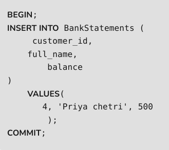
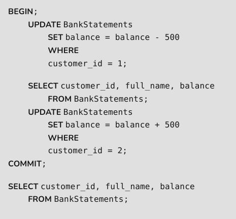
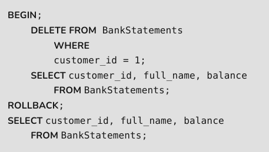
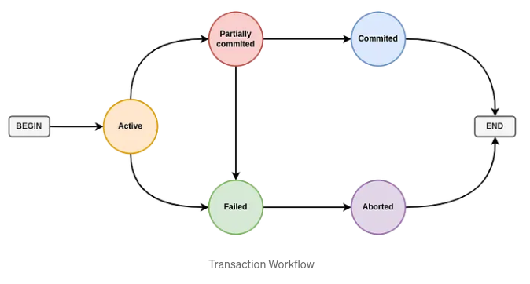

.. _transactions-label:

Transactions
============
- a transaction in the context of databases like PostgreSQL is a unit of work that ensures data integrity and consistency
- Transactions are fundamental when you need to add, delete, or update records
- are vital for maintaining the accuracy and reliability of a database
- They ensure that even if an operation fails or the system crashes, the data remains consistent and accurate

ACID
----
- ACID Properties of Transaction:
    - Atomicity: Guarantees that all parts of a transaction are completed successfully. If any part fails, the entire transaction is rolled back
    - Consistency: Ensures that a transaction can only bring the database from one valid state to another, maintaining database invariants
    - Isolation: Provides the illusion that each transaction is the only one interacting with the database, thereby preventing transactions from interfering with each other
    - Duability: Once a transaction has been committed, it will remain so, even in the event of a system failure

Key Transaction Commands in PostgreSQL
--------------------------------------
- there are 3 main commands in a transaction block:
    1. BEGIN: Starts a transaction block.
    2. COMMIT: Commits the current transaction block, making all changes made within the block permanent.
    3. ROLLBACK: Cancels all changes made in the current transaction block, reverting to the state before the transaction began.

    .. code-block:: python
       :linenos:

        CREATE TABLE BankStatements (
            customer_id serial PRIMARY KEY,
            full_name VARCHAR NOT NULL,
            balance INT
        );
        INSERT INTO BankStatements (
            customer_id ,
            full_name,
            balance
        )
        VALUES
            (1, 'Sekhar rao', 1000),
            (2, 'Abishek Yadav', 500),
            (3, 'Srinivas Goud', 1000);

BEGIN key:
- is used to initiate a transaction
- To start a transaction we should give BEGIN command at first if we don't give it like that then the database cant able recognizes the transaction

COMMIT key:
- is used to save changes and reflect them in the database
- if the commit is not executed, then the changes are not reflected in the database

ROLLBACK key:
- is used to undo the changes done in transactions

Transaction States
------------------
- there are 6 states:
    - active:
        - This is the first state during the execution of the transaction
        - A transaction is active as long as the instructions (Query) are executed
    - partially committed:
        - A change has been updated in this state but the database has not yet committed these changes on disk
        - the data buffer is stored in a memory buffer, and the buffer is not yet written in the database
    - committed:
        - the buffer data is stored in the database
        - the changes have been reflected in the database
    - faile state (Rollback):
        - If the transaction is aborted (ROLLBACK) from the Active or partially committed state or the transaction is failed, the transaction is moved to the failed state
    - end:
        - This is the last transaction state after the committed state or the failed state
        - This state indicates the end of the transaction

:ref:`Go Back <db-label>`.