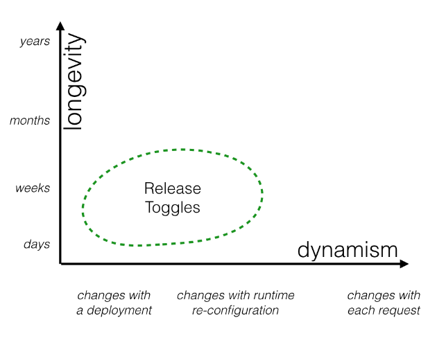
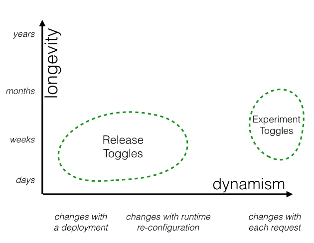
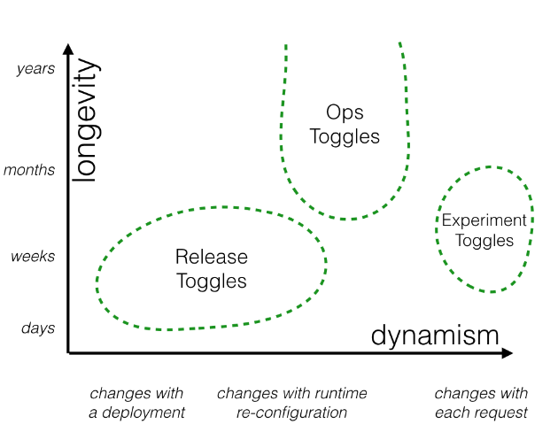
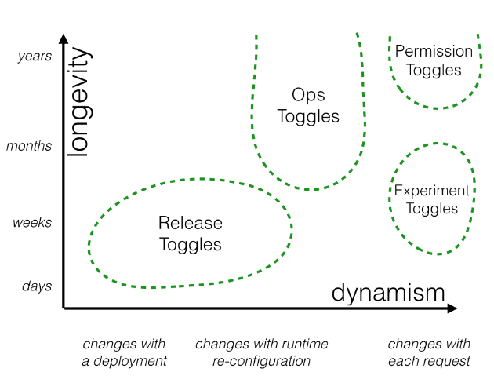

.. _general_feature_flags_label:

Feature Toggles (aka Feature Flags)
===================================

- Feature Toggles (often also refered to as Feature Flags)  are a powerful technique, allowing teams to modify system behavior without changing code
- Toggles introduce complexity
- We can keep that complexity in check by using smart toggle implementation practices and appropriate tools to manage our toggle configuration, but we should also aim to constrain the number of toggles in our system

Categories
-----------
- Feature toggles can be categorized across two major dimensions: how long the feature toggle will live and how dynamic the toggling decision must be
- types:
    - Releae Toggles
    - Experiment Toggles
    - Ops Toggles
    - Permissioning Toggles

1. Release Toggles
-------------------
- These are feature flags used to enable trunk-based development for teams practicing Continuous Delivery
- They allow in-progress features to be checked into a shared integration branch  while still allowing the branch to be deployed to production at any time
- allow incomplete and un-tested codepaths to be shipped to production as latent code which may never be turned on
- Using Release Toggles in this way is the most common way to implement the Continuous Delivery principle of “separating [feature] release from [code] deployment.”

- They should generally not stick around much longer than a week or two, although product-centric toggles may need to remain in place for a longer period.

2. Experiment Toggles
---------------------
- Experiment Toggles are used to perform multivariate or A/B testing
- Each user of the system is placed into a cohort and at runtime the Toggle Router will consistently send a given user down one codepath or the other, based upon which cohort they are in
- By tracking the aggregate behavior of different cohorts we can compare the effect of different codepaths.
- This technique is commonly used to make data-driven optimizations to things such as the purchase flow of an ecommerce system, or the Call To Action wording on a button

- An Experiment Toggle needs to remain in place with the same configuration long enough to generate statistically significant results

3. Ops Toggles
--------------
- These flags are used to control operational aspects of our system's behavior
- We might introduce an Ops Toggle when rolling out a new feature which has unclear performance implications so that system operators can disable or degrade that feature quickly in production if needed
- Most Ops Toggles will be relatively short-lived - once confidence is gained in the operational aspects of a new feature the flag should be retired.
- However it's not uncommon for systems to have a small number of long-lived “Kill Switches” which allow operators of production environments to gracefully degrade non-vital system functionality when the system is enduring unusually high load
- For example, when we're under heavy load we might want to disable a Recommendations panel on our home page which is relatively expensive to generate

- many of these flags are only in place for a short while, but a few key controls may be left in place for operators almost indefinitely
- Since the purpose of these flags is to allow operators to quickly react to production issues they need to be re-configured extremely quickly 

4. Permissioning Toggles
------------------------
- These flags are used to change the features or product experience that certain users receive
- For example:
    - we may have a set of “premium” features which we only toggle on for our paying customers
    - Or perhaps we have a set of “alpha” features which are only available to internal users and another set of “beta” features which are only available to internal users plus beta users
- is similar in maby ways to a Canary Release
- The distinction between the two is that a Canary Released feature is exposed to a randomly selected cohort of users while a feature enabled by Permission toggles is exposed to a specific set of users

- When used as a way to manage a feature which is only exposed to premium users a Permissioning Toggle may be very-long lived compared to other categories of Feature Toggles
- Since permissions are user-specific the toggling decision for a Permissioning Toggle will always be per-request, making this a very dynamic toggle

Implementation Techniques
--------------------------
1. De-coupling decision points from decision logic
- One common mistake with Feature Toggles is to couple the place where a toggling decision is made (the Toggle Point) with the logic behind the decision (the Toggle Router)

- example:
    -  One of our new features will allow a user to easily cancel an order by clicking a link inside their order confirmation email (aka invoice email)

    .. image:: ../images/general/feature-toggles/de-coupling-decision-1.png
        :align: center

    - problems :
        - The decision on whether to include order cancellation functionality in our invoice emails is wired directly to that rather broad next-gen-ecomm feature 
        - Why should the invoice emailling code need to know that the order cancellation content is part of the next-gen feature set
        - What happens if we'd like to turn on some parts of the next-gen functionality without exposing order cancellation
    - solution:
        - We've introduced a FeatureDecisions object, which acts as a collection point for any feature toggle decision logic
        - We create a decision method on this object for each specific toggling decision in our code - in this case “should we include order cancellation functionality in our invoice email” is represented by the includeOrderCancellationInEmail decision method
        - Right now the decision “logic” is a trivial pass-through to check the state of the next-gen-ecomm feature, but now as that logic evolves we have a singular place to manage it

    .. image:: ../images/general/feature-toggles/de-coupling-decision-2.png
        :align: center

2. Invesion of Decision
- In the previous example our invoice emailer was responsible for asking the feature flagging infrastructure how it should perform
- This means our invoice emailer has one extra concept it needs to be aware of - feature flagging - and an extra module it is coupled to
- solution:
    

    .. image:: ../images/general/feature-toggles/inversion-decision-1.png
        :align: center

    - rather than our InvoiceEmailler reaching out to FeatureDecisions it has those decisions injected into it at construction time via a config object
    - InvoiceEmailler now has no knowledge whatsoever about feature flagging
    - It just knows that some aspects of its behavior can be configured at runtime
    - This also makes testing InvoiceEmailler's behavior easier - we can test the way that it generates emails both with and without order cancellation content just by passing a different configuration option during test

    .. image:: ../images/general/feature-toggles/inversion-decision-2.png
        :align: center

3. Avoiding conditionals
- In our examples so far our Toggle Point has been implemented using an if statement.
- This might make sense for a simple, short-lived toggle
- However point conditionals are not advised anywhere where a feature will require several Toggle Points, or where you expect the Toggle Point to be long-lived
- A more maintainable alternative is to implement alternative codepaths using some sort of Strategy pattern

    .. image:: ../images/general/feature-toggles/avoid-conditionals-1.png
        :align: center

- Here we're applying a Strategy pattern by allowing our invoice emailer to be configured with a content enhancement function

:ref:`Go Back <general-label>`.