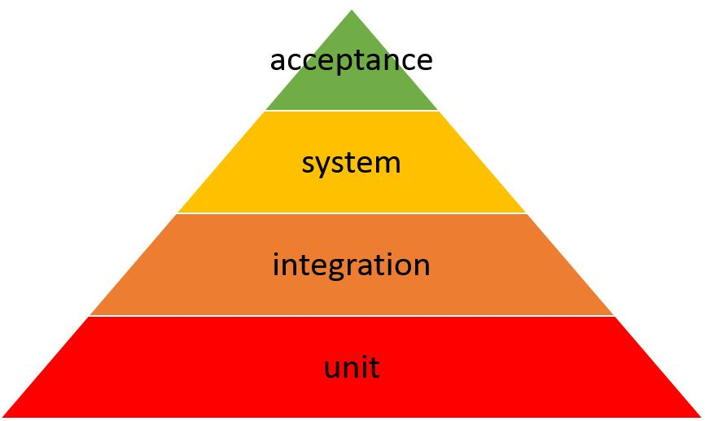

.. _testing-label:

Testing
=======

Why ?
-------

- to make sure that what we create does what it's supposed to do
- something that works when one person is using it may not work when hundreds of people are using it
    - the stress of hundreds of people using the application at the same time can be enough to bring it crashing down
- there's always a change that a user really will do that - no matter how silly it seems
    - we all know that : "No user would ever do that", but still, we need to test it
- there are lots of different devices, browsers and operating systems out there
    - testing on multiple devices can make sure your application works for as many of your users as possible
- we owe it to our users and ourselves to deliver the best application we can

Test Pyramid
--------------

- Unit Test
    - is a level of software testing where individual units/ components of a software are tested
    - is the smallest testable part of software
    - the purpose is to validate that each unit of the software performs as designed
    - it usually has one or a few inputs and usually a single output
    - it is done using:
        - JUnit + JParameter

        .. image:: ../images/testing/unit-test-junit.png
            :width: 1200px
            :height: 700px
            :scale: 50 %
            :align: center

        - Groovy + Spock

        .. image:: ../images/testing/unit-test-spock.png
            :width: 1200px
            :height: 700px
            :scale: 50 %
            :align: center

- Integration Testing
    - is a level of software testing where individual units are combined and tested as a group
    - the purpose is to expose faults in the interaction between integrated units
    - is split into:
        - integration testing
            - Testing performed to expose defects in the interfaces and in the interactions between integrated components or systems
            - done through milestones framework:
                - it deploys and starts a real platform with real components
                - is mocking the actions & requests sent by the screen

            .. image:: ../images/testing/milestone-spock.png
                :width: 1200px
                :height: 700px
                :scale: 50 %
                :align: center

        - component integration testing
            - Testing performed to expose defects in the interfaces and interaction between integrated components
            - done through component test framework (work in progress)
                - it starts a mocked platform
                - creates real instances of services for only bundle and it mocked the services for the rest of bundles

- System Testing
    - is a level of software testing where a complete and integrated software is tested
    - the purpose is to evaluate the system's compliance with the specified requirements
    - is the process of testing an integrated system to verify that it meets specified requirements

- Acceptance Testing
    - is a level of software testing where a system is tested for acceptability
    - the purpose is to evaluate the system's compliance with the business requirements and assess whether it is acceptable for delivery
    - is formal testing with respect to user needs, requirements, and business processes conducted to determine  whether or not a system satisfies the acceptance criteria and to enable the user, customers or other authorized entity to determine whether or not to accept the system.

QA Levels in Ullink
-------------------
- there are 4 levels:
    - QA Level 1
        - Unit Testing
    - QA Level 2
        - product testing
        - Miletone + TestComplete + Performance testing
        - it is testing only the components needed ( example : bypass some extension)
        - example : test UL Journal, the actions were send to UL Monitoring Extension which is calling directly the UL Journal
    - QA Level 3
        - integration testing
        - example:
            - test UL Journal: Fix Message send to Bridge => Bridge send to Monitoring Plugin => Monitoring Extension => UL Journal
    - QA LEvel 4
        - system testing on the system custom for the client
        - uses workflows specific for each client

- link :
    - http://softwaretestingfundamentals.com/unit-testing/

:ref:`Go Back <general-label>`.