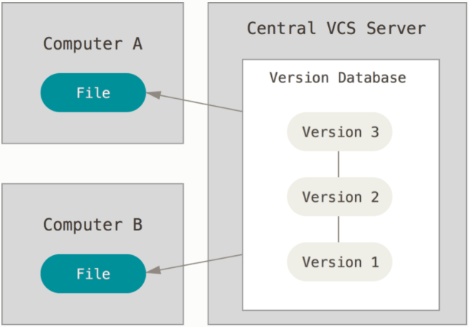

.. _general-git-label:

Git
===
About Version Control System (VCS)
----------------------------------
- a VCS records changes to a file or set of files over time so that you can recall specific version later
- it allows you to
    - revert files back to a previous state
    - revert the entire project back to a previous state
    - compare changes over time
    - see who last modified something, who introduced an issue
- using a VCS means if you screw thinks up or lose files, you can easily recover
- Local Version Control Systems
    - copy files into another directory:
        - it is very simple
        - but very error prone ( it is easy to forget which directory you are )
    - alternative : changes were saved in a DB

- Centralized Version Control Systems
    - because people need to collaborate with developers on other systems
    - examples : CVS, Subversion, Perforce.
    - have a single server that contain all the version files and a number of clients that check out file
    - advantage : everyone knows what everyone else is doing on the project
    - downside :
        - single point of failure : if the server goes down, no client can use it
        - if the hard disk becomes corrupted and proper backup haven't been kept, you lose everything

- Distributed Version Control Systems
    - in a DVCS clients don't just check out the latest snapshot of the file: they fully mirror the repository
    - if any server dies, then any of the client repositories can be copied back to the server to restore it
    - example : Git, Mercurial, Bazaar, Darcs

Git Basics
----------
- Snapshots, not Differences
    - the major difference between Git and other VCS is the way Git thinks about its data
    - most other systems store information as a list of file-based changes. These systems think of the information
      they keeps as a set of files and the changes made to each file over time

    .. image:: ../../images/git/SnapshotNotDifferences1.png
        :width: 1200px
        :height: 700px
        :scale: 50 %
        :align: center

    - Git doesn't store its data this way
    - it thinks of its data more like a set of snapshots of miniature filesystems
    - every time you commit, it basically takes a picture of what all your files
      look like at that moment and stores a reference of that snapshot
    - to be efficient, if files have not changed, Git doesn't store the file again, just a link to the previous identical file
    - Git thinks about its data more like a stream of snapshots

    .. image:: ../../images/git/SnapshotNotDifferences2.png
        :width: 1200px
        :height: 700px
        :scale: 50 %
        :align: center

- Nearly Every Operation is Local
    - most operations in Git only need local files and resources to operate => most operations seem almost instantaneous
    - generally no information is needed from another computer on your network
    - on the other CVCS, most operations have that network latency overhead
    - example : to browser the history of the project, Git doesn't need to go out to the server to get the
      history it simply reds it directly from your local database

- Git Has Integrity
    - everything in Git is check-summed before it is stored and is referred to by that checksum
    - the mechanism that Git uses for this check-summing is called a SHA-1 hash:
        - is a 40-character string composed of hexadecimal
        - is calculated based on the contents of a file or directory structure in Git
    - Git stores in its databases not by file name, but by the hash value of its contents

- The Three States
    - Git has three main states that your files can reside in:
        - committed -> the data is safely stored in your local database
        - modified -> you have changed the file but have not committed it to your database yet
        - staged -> you have marked a modified file in its current version to go into your next commit snapshot
    - there are 3 main sections of git project:
        - the Git directory:
            - where Git stores the metadata and object database for your project
            - is the most important part of Git
            - is what is copied when you clone a repository from another computer
        - the working tree:
            - is a single checkout of one version of the project
            - these files are pulled out of the compressed database in the Git directory and placed on disk for you to use or modify
        - the staging area:
            -is a file, generally contained in your Git directory, that stores information about what will go into your next commit

        .. image:: ../../images/git/ThreeStates.png
            :width: 1200px
            :height: 700px
            :scale: 50 %
            :align: center

- Getting Help
    - git help -> list most common commands
    - git help <verb> -> open a description in the browser
    - git <verb> --help -> open a description in the browser

- Getting Git Repository
    - you can create an empty git repository using : git init
    - you can clone a new repository -> git clone ssh://imesaros@gerrit.ullink.lan:29418/ul-allocation-odisys-api-helpers

Recording changes to the Repository
-----------------------------------
- each file in your working directory can be in one of two states:
    - tracked:
        - are files that were in the last snapshot
        - they can be unmodified, modified or staged
    - untracked : everything else, any file that were not in your last snapshot and are not in staging area
- life cycle:
    - all files will be tracked and unmodified (start when you first clone a repository, you haven't edit anything )
    - as you edit files, Git seems them as modified, because you've changed them since your last commit
    - you state these modified files
    - commit all staged changes

    .. image:: ../../images/git/LifecycleOfTheStatus.png
        :width: 1200px
        :height: 700px
        :scale: 50 %
        :align: center

- Checking the status of your files
    - the main command is : git status
- Tracking new files & Staging modified files
    - the main command is : git add <file>
- Ignoring Files
    - you may have files which you don't want Git to automatically add or even show you as being untracked ( like .class files )
    - you can create a file listing patterns to match them named : .gitignore
    - a file example:

    .. image:: ../../images/git/Git-Ignore.png
        :width: 1200px
        :height: 700px
        :scale: 50 %
        :align: center

- Viewing your staged and unstaged changes
    - the main command is: git diff -> compares what is in working area with what is your stage area
    - git diff --staged -> shows what you have staged that will go into your next commit
    - shows the exact lines added and removed
- Committing Your Changes
    - the main command is : git commit
    - it will commit only the staged files
    - running:
        - git commit -> will open the editor defined for section [core.editor] in .gitconfig
        - git commit -m 'some test' -> will create the commit having the corresponding commit message
        - git commit -a -m 'some test' -> will create the commit containing also the modified files which were not yet staged

Viewing the Commit History
--------------------------
- git log -> shows the commits made in the repository
- gitk -> shows the history for the current branch
- gitk --all -> shows the history for all branches

Undoing Things
--------------
- this is one of the few areas in Git where you might lose some work if you do it wrong
- how to do this:
    - to amend:
        - git commit --amend
        - it takes the staging area and use it for the commit
        - alternative: from git gui
    - to revert a staged file:
        - git reset HEAD <file>
    - to revert a modified file:
        - remove the modifications done in a file
        - the git command is shown when using :git status
        - the git command : git checkout -- <file>

Tagging
-------
- is used to mark a specific point in history as being important
- example: ro mark a release point
- Listing tags:
    - git command: git tag
    - you can search for a given pattern: git tag -l "version"
- Creating tag:
    - git command: git tag -a <name> -m "message"
- Sharing tags
    - git command : git push [remote-name] [tag-name]
    - example: git push origin 1.1.1_00
    - git push origin --tags -> will push all the tags which are not existing to the remote

Branching
---------
- branching means you diverge from the main line of development and continue to do work without messing with that main line
- when you commit, Git stores a commit object that contains:
    - a pointer to the snapshot of the content you stage (a tree object) which contains:
        - blob -> for actual files
        - tree -> for subdirectories. It is represented by pointer to other tree objects
    - author's name and email
    - the message
    - pointers to the commit that directly came before this commit

- if you make some changes and commit again, the next commit stores a pointer to the commit that came immediately before

- a branch in Git is simply a lightweight movable pointer to one if these commits
- the default branch name in Git is master
- every time you commit, the branch it moves forward automatically
- a pointer HEAD is used for Git to know on which branch you are
- a branch is actually a simple file that contains the 40 character SHA-1 checksum of the commit it points to

- Creating a New Branch
    - when a new branch is created, a new pointer is created for you to move around
    - it can be used :
        - git branch <branch_name>
        - git checkout -b <branch_name>

    .. image:: ../../images/git/NewBranch.png
        :width: 1200px
        :height: 700px
        :scale: 50 %
        :align: center

- Switching Branches
    - when you move to another branch, you actually move to the associated commit
    - it can be used command : git checkout <branch_name>

- Deleting Branch
    - it can be deleted with :
        - git branch delete [-d|-D] <branch_name>

- Merging
    - it is used to merge two branches into one
    - Git uses three-way merge, using the two snapshots pointed to by the branches and the common ancestor fo the two:
        - instead of moving the branch pointer forward, Git creates a new snapshot that results from this three-way merge
        - automatically creates a new commit that points to it and has more parents

    .. image:: ../../images/git/NewBranch.png
        :width: 1200px
        :height: 700px
        :scale: 50 %
        :align: center

    - there are cases when the merge cannot be done automatically, so human intervention is needed:
        - it can be used : git mergetool

- Remote Branches
    - remote references are references in your remote repositories: branches, tags
    - command : git ls-remote [remote] (or git remote show [remote])
    - remote branches are local references that you can't move; they are moved automatically when you do a network communication
    - Fetching:
        - retrieve all the changes on the server
        - it won't modify the working directory
        - it will let you merge yourself the commits
        - git command : git fetch [remote] [branch]
        - will update the branch [remote]/[branch] based on the remote server
    - Pushing:
        - local branches aren't automatically synchronized with the remotes, you have to explicitly  push the branches
        - git command: git push [remote] [branch]
    - Pulling:
        - fetch the server changes but changes the working directory
        - git fetch + git merge
    - Deleting Remote Branches:
        - git command : git push [remote] --delete [branch]

- Rebasing:
    - in Git, there are 3 main ways to integrate changes from one branch into another:
        - rebase
        - cherry-pick
        - merge
    - with the rebase command, you can take all the changes that were committed on one branch and replay them on another one
    - git command : git rebase [branch]
    - it does not diverge the history log, but it keeps commits in a linear way
    - default behavior is to take all the commits which exists inly on the current branch and reply them on the new branch
    - it can be selected only a part of them by using : git rebase -i [branch]

    .. image:: ../../images/git/Rebase1.png
        :width: 1200px
        :height: 700px
        :scale: 50 %
        :align: center

    - more complex examples:

    .. image:: ../../images/git/Rebase2.png
        :width: 1200px
        :height: 700px
        :scale: 50 %
        :align: center

    .. image:: ../../images/git/Rebase3.png
        :width: 1200px
        :height: 700px
        :scale: 50 %
        :align: center

- Cherry-pick
    - it is used when specific commits needs to be reported on branches
    - git command : git cherry-pick [commit_SHA-1]

    .. image:: ../../images/git/cherrypick.png
        :width: 1200px
        :height: 700px
        :scale: 50 %
        :align: center

Working with Remotes
--------------------
- remote repositories are versions of your project that are hosted on network somewhere
- you can have several of them
- collaborating with other involves managing these repositories and pushing and pulling data to and from them
- Showing your remotes:
    - git command : git remote
    - example: git remove -v
    - "origin" is the default name Git gives to the server you cloned from
- Adding Remote Repository:
    - git command: git remote add [remote-name] [url]
    - example: git remote add test url-test
- Removing Remote Repository:
    - git remote remove [remote-name]
    - example: git remote remove test
- Fetching and Pulling from your Remotes
    - git fetch [remote-name]
        - to get data from your remote projects
        - does not automatically merge the changes with your work or modify what you are currently working
    - git pull
        - automatically fetch and merge that remote branch into your current branch
        - git pull [remote-name] [branch-name]
    - example: git pull origin master
- Pushing to Your Remotes
    - git push [remote-name] [branch-name]
    - example: git push origin master
    - it is working if the remote has write access and nobody pushed another commit which is in conflict with your

- Bibliography:
    - https://git-scm.com/book/en/v2
- :ref:`Go Back <index-label>`.