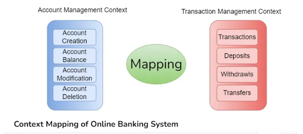
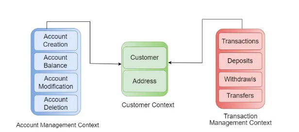

.. _ddd-label:

Domain Driven Design
====================
    - is a method that prioritizes understanding and modeling the specific problem area where a software system functions

What is Domain-Driven Design
----------------------------
    - Domain
        - This refers to the specific subject area or problem that the software system aims to address
        - For instance, in a banking application, the domain involves concepts like accounts, transactions, customers, and relevant banking regulations
    - Driven
        - Driven" means that the design of the software system is influenced by the features and needs of the domain
        - This indicates that design choices are based on a solid understanding of the domain, rather than just technical aspects or implementation details
    - Design
        - is the process of making a plan or blueprint of a software system
        - This includes how different components will interact and how the system will meet its functional and non-functional requirements

Importance of Domain Knowledge
------------------------------
    - even if the software was written with the lastest tech stack and infrastructure and our software design architecture is amazing, but in the end, the user who decides whether our system is great or not
    - Also if the system does not solve business needs, then it is of no use to anyone

Strategic Design in DDD
-----------------------
    - Strategic Design in DDD focuses on defining the overall architecture and structure of a software system in a way that aligns with the problem domain
    -  It addresses high-level concerns as:
        - how to organize domain concepts
        - how to partition the system into manageble parts
        - how to establish clear boundaries between different components

1. Bounded Context

    - Each Bounded Context corresponds to a microservice or a specific problem area
    - Sets clear boundaries for terms that may have different meanings in different parts of the system
    - Allows teams to develop models specific to each context, reducing confusion and inconsistency
    - Breaks down large, complex domains into smaller, more manageable parts

2. Context Mapping

    - The process of defining relationships and interactions between different Bounded Contexts
    - Identifies areas where contexts overlap or integrate.
    - Establishes clear communication and agreements between different contexts.
    - Includes methods like Partnership, Shared Kernel, and Customer-Supplier for effective mapping

3. Strategit Patterns

    - General guidelines for organizing the architecture of a software system in alignment with the problem domain
    - Includes patterns like Aggregates, Domain Events, and Anti-Corruption Layer
    - Offers solutions to recurring problems in domain-driven design

4. Shared Kernel

    - A strategic pattern that identifies common areas between different Bounded Contexts and establishes a shared subset of the domain model
    - This shared subset (or kernel) enables collaboration and integration while allowing each context to maintain its own distinct model.
    - Should be used carefully, as it introduces dependencies between contexts that can lead to coupling if not managed properly

5. Anti-Corruption Layer (ACL)
    - A strategic pattern designed to protect a system from the influence of external or legacy systems that use different models or languages
    - Acts as a translation layer between the external system and the core domain model.
    - Transforms data and messages to ensure compatibility between systems.

6. Ubiquitous Language
    - The main goal is to create a common understanding among team members, which helps everyone communicate more clearly about domain concepts and requirements.
    - It emphasizes the use of precise terms that have clear meanings, ensuring everyone is on the same page
    - The language closely mirrors the terminology used in the business context, making sure the software accurately reflects real-world processes

Tactical Design Patterns in DDD
-------------------------------

- actical design patterns are specific strategies or techniques used to structure and organize the domain model within a software system

1. Entity

- An entity is a domain object that has a distinct identity and lifecycle
- Entities are characterized by their unique identifiers and mutable state
- They encapsulate behavior and data related to a specific concept within the domain
- For example: in a banking application, a BankAccount entity might have properties like account number, balance, and owner, along with methods to deposit, withdraw, or transfer funds.

2. Value Object

- is a type of domain object that represents a value that is conceptually unchangeable
- Unlike entities, value objects lack a unique identity and are usually used to describe attributes or characteristics of entities
- They are compared for equality based on their properties rather than their identity
- For example, a Money value object might represent a specific amount of currency, encapsulating properties like currency type and amount.

3. Aggregate

- An aggregate is a cluster of domain objects that are treated as a single unit for the purpose of data consistency
- Aggregates consist of one or more entities and value objects, with one entity designated as the aggregate root
- Aggregates enforce consistency boundaries within the domain model, ensuring that changes to related objects are made atomically.
- For example, in an e-commerce system, an Order aggregate might consist of entities like OrderItem and Customer, with the Order entity serving as the aggregate root.

4. Repository

- Repositories separate data access logic from the domain model.
- They provide a consistent interface for querying and storing domain objects.
- Repositories hide the specifics of how data is retrieved or stored.
- They encapsulate the translation between domain objects and underlying data storage methods, such as databases or external services.
- For example, a CustomerRepository might provide methods for querying and storing Customer entities.

5. Factory

- A factory is a creational pattern used to encapsulate the logic for creating instances of complex domain objects.
- Factories abstract the process of object instantiation, allowing clients to create objects without needing to know the details of their construction
- For example, a ProductFactory might be responsible for creating instances of Product entities with default configurations.

6. Service

- A service is a domain object that represents a behavior or operation that does not naturally belong to any specific entity or value object.
- Services encapsulate domain logic that operates on multiple objects or orchestrates interactions between objects.
- Services are typically stateless and focus on performing specific tasks or enforcing domain rules.
- For example, an OrderService might provide methods for processing orders, applying discounts, and calculating shipping costs.

Benefits of DDD
---------------

- Promotes effective communication among domain experts, developers, and stakeholders using a common language.
- Helps teams prioritize the most valuable areas of the application to meet business objectives.
- Encourages designs that adapt to evolving business needs and market conditions.
- Maintains a distinct separation between domain logic, infrastructure, and user interface.
- Supports well-defined domain objects for easier and more focused testing.

Challenges of DDD
-----------------

- DDD can introduce complexity, especially in large domains
- In complex domains, aligning different models and bounded contexts can be difficult
- Implementing DDD may require new technologies and frameworks, complicating integration with existing systems
- Addressing performance and scalability issues is crucial for successful adoption.

:ref:`Go Back <software_developer_approach-label>`.